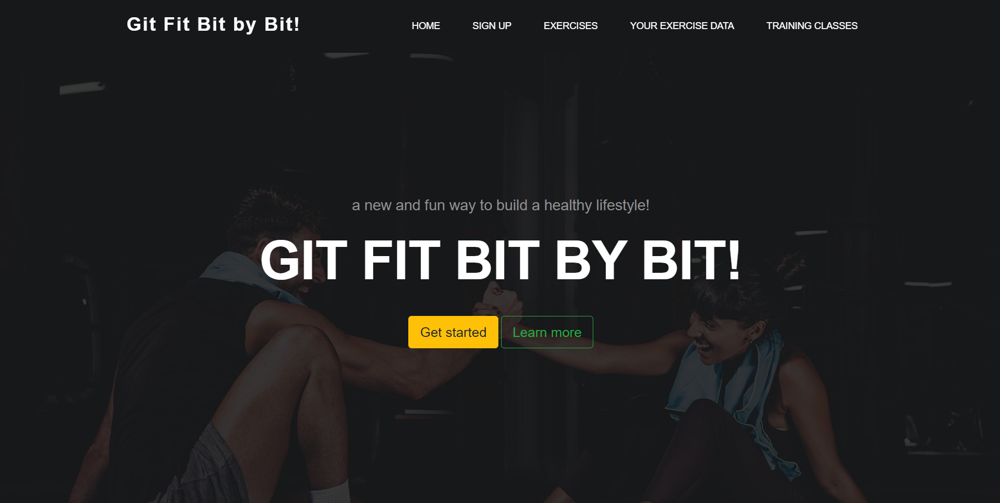

# Get Fit Bit By Bit

#### Latest version date 7/9/2020

#### By Ian Scott, Evgeniya Chernaya, Spencer Moody and Deryck Jackson

## Description

Get Fit Bit By Bit is a sample exercise tracking website which takes in user submitted exercise data to provide a small selection of charts for visual data consumption. The website also includes a variety of motivational quotes, and an exercise suggester for users to assist in their fitness growth. Unlike many other fitness trackers, this website also allows the user to individual sets of strength training reps (e.g., push-ups, sit-ups etc).

## Specifications

| Spec | Input | Output |
| :-------------      | :------------- | :------------- |
| 1. Program will create an exercise class | -- | Exercise { name: walking, time: 12:00, distance: .6, date: "2020 07 07" }  |
| 2. Program will create local array variable for storing new class instances | -- | exercises = [] |
| 3. Program will calculate calorie burn based on exercise type | walking | 120 calories |
| 4. Program will create a Person class with name, gender, age, height and weight | -- | Person { name: Sue, gender: female, weight: 140 }|

## Setup and Installation

_Open via Bash/GitBash_
  1. Clone this repository onto your computer: https://github.com/DeryckJackson/get-fit-bit-by-bit.git
  2. Navigate into the "get-fit-bit-by-bit" directory in Visual Studio Code, or your preferred text editor
  3. Install all necessary packages with the following terminal command: $ npm install
  4. Build the project with: $ npm run build
  5. Open a live development server in your browser with: $ npm run start

## Bugs

_There are no currently known bugs._

## Tech used

_This program utilizes HTML, CSS, Bootstrap, JQuery, Node Packet Manager, Jest for test-driven development, promises, API calls, and chart.js. This website design was based around the Gymso Fitness Template from tooplate.com (https://www.tooplate.com/view/2119-gymso-fitness). Furthermore this project was made with the power and technology of Friendship!_

## Support and contact details

_If you have any questions, run into any issues or bugs, or if you would like to contribute to this project, please contact any of the authors via their respective github.com accounts._

### License

This project is licensed under the [MIT License](https://opensource.org/licenses/MIT).

Copyright (c) 2020 Deryck Jackson, Ian Scott, Evgeniya Chernaya, and Spencer Moody
